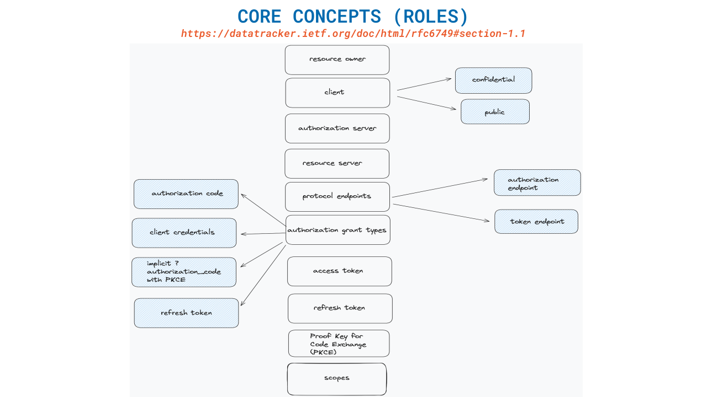
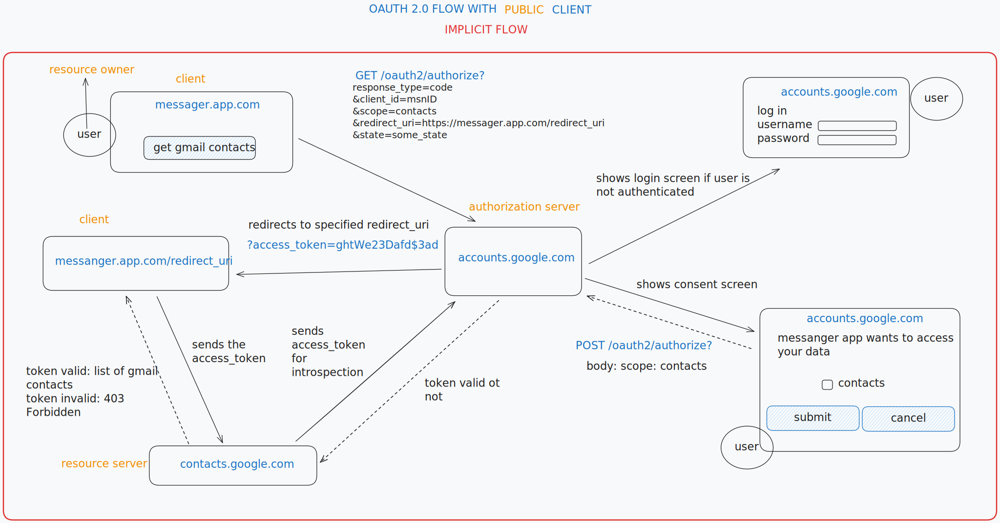
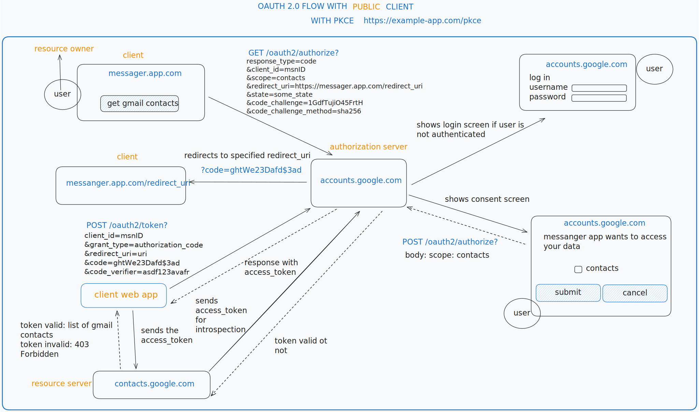
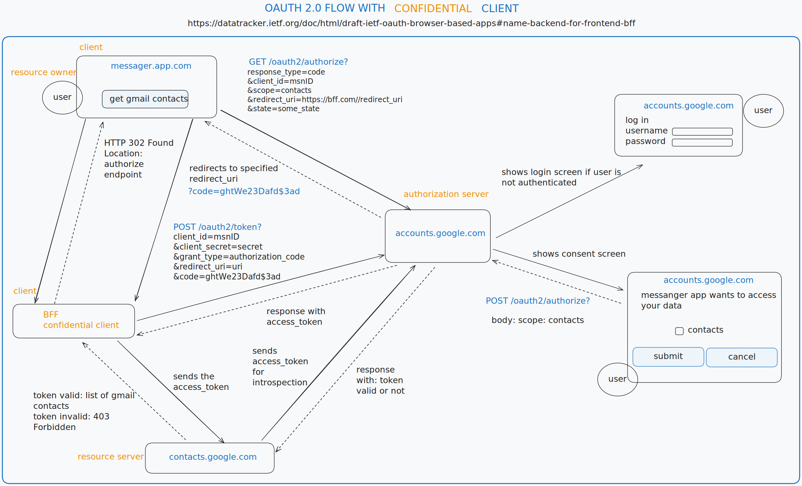
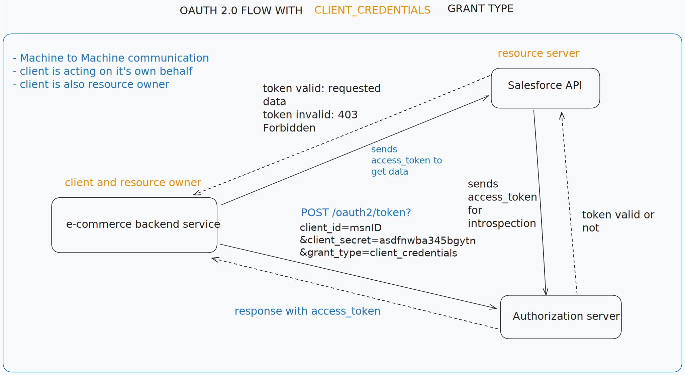

### OAuth 2.0 FLow

### What is it, why do we need it?
OAuth 2.0 is an authorization framework that provides a way to authorize apps to access our data on other websites or services
without needing to share our credentials.

Confusion - authorization / authentication

Authorization: OAuth 2.0 is designed to give apps permission to access a user’s data on another service. It answers the question,
"Is this app allowed to access this specific data or resource?"

Authentication: This is about verifying the identity of a user—answering the question, "Who is this user?

### Useful links
https://www.oauth.com/playground/

### oauth 2.0 presentation drawings - use https://excalidraw.com/
[drawings](./docs/oauth2.0-24.02.excalidraw)
