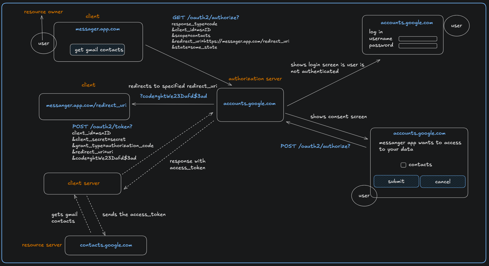

### OAuth 2.0 FLow

### What is it, why do we need it?
OAuth 2.0 is an authorization framework that provides a way to authorize apps to access our data on other websites or services
without needing to share our credentials.

Confusion - authorization / authentication

Authorization: OAuth 2.0 is designed to give apps permission to access a user’s data on another service. It answers the question,
"Is this app allowed to access this specific data or resource?"

Authentication: This is about verifying the identity of a user—answering the question, "Who is this user?

#### Core Concepts
https://excalidraw.com/#json=oIc326B8dep1jcBM6ye4L,1oupOH2SUJK3NWpyX49VzA

- resource owner
- client
- authorization server
- resource server
- protocol endpoints
  - authorization endpoint
  - token endpoint
  - redirection endpoint
- authorization grant types
  - authorization code
  - client credentials
  - implicit
- access token
- Proof Key for Code exchange (PKCE)
- oauth2/authorize
    - response_type
    - client_id
    - scope
    - redirect_uri
    - state
- oauth2/authorize with (PKCE)
  - response_type
  - client_id
  - scope
  - redirect_uri
  - state
  - code_challenge
  - code_challenge_method
- oauth2/token
    - client_id
    - client_secret
    - grant_type
    - redirect_uri
    - code
- oauth2/token with (PKCE)
  - client_id
  - client_secret
  - grant_type
  - redirect_uri
  - code
  - code_verifier

### Useful links
https://www.oauth.com/playground/

### oauth2 flow
